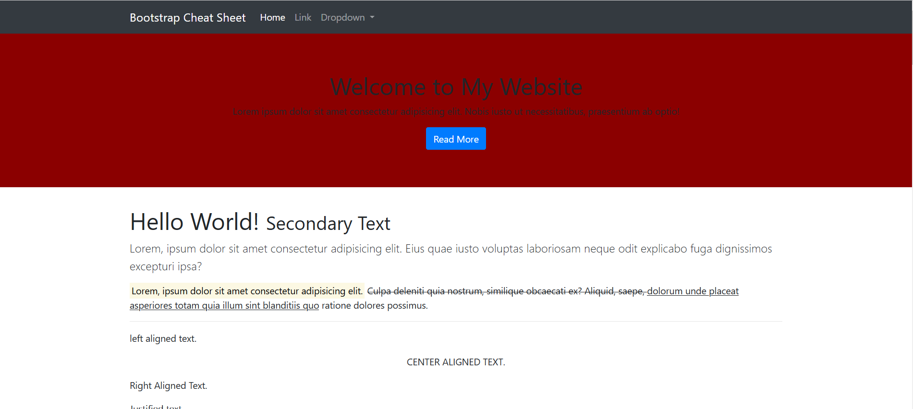
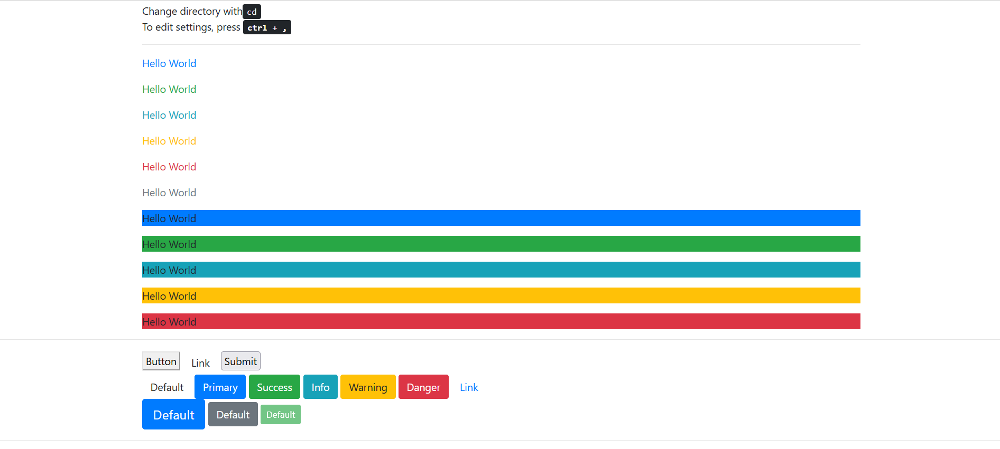
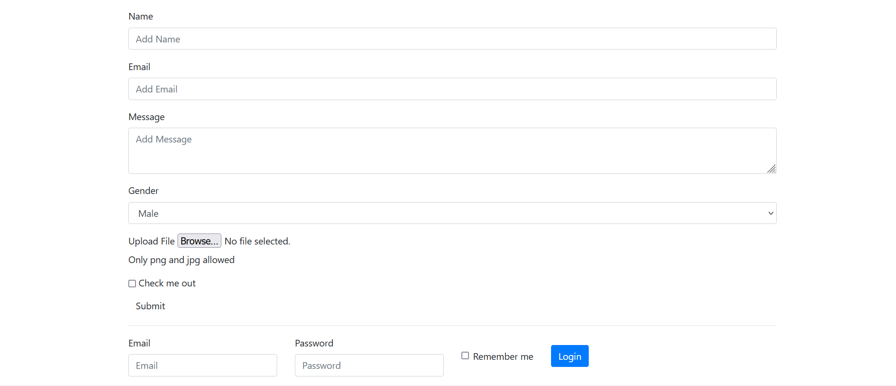

# bootstrap-app

Bootstrap Cheat Sheet

<!-- Live link to deployed app -->

Repository: https://github.com/Mdudzik92/bootstrap-app 
Deployed app: https://mdudzik92.github.io/bootstrap-app/

<!-- Technologies used -->

HTML, CSS, Bootstrap

<!-- Explanation of what the app is -->

This is a simple, responsive Bootstrap 5 cheat sheet for reference. It includes helper classes, grids, images, a progress bar, forms, a navbar, and more.

<!-- Screenshot -->

<!-- License -->

MIT

<!-- Contact information -->

Email: mdudzik92@gmail.com
